# Midjourney 整理

重点是：**先锁构图，再锁风格，最后才拼细节**。

---

## 先看四张示意图

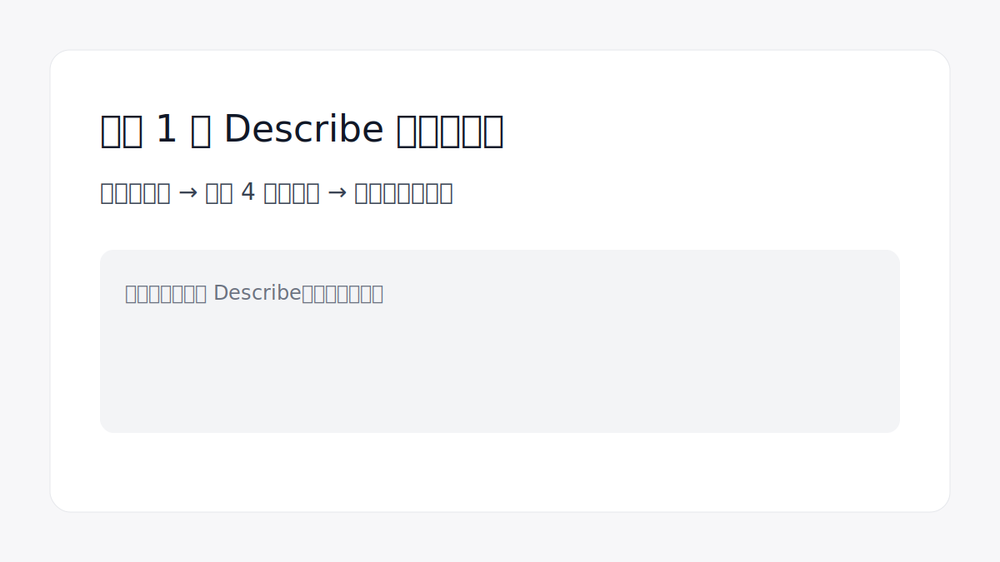


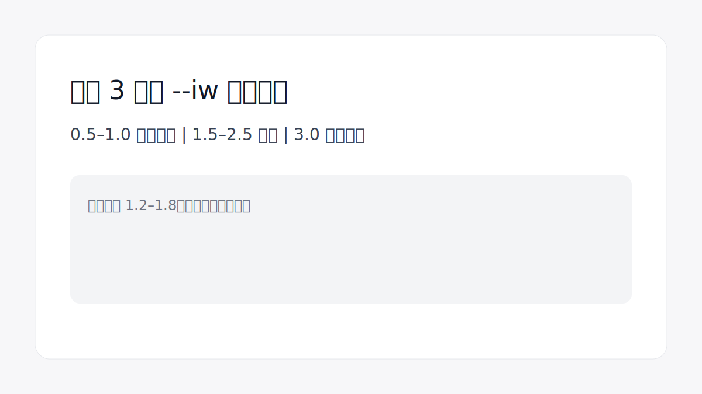

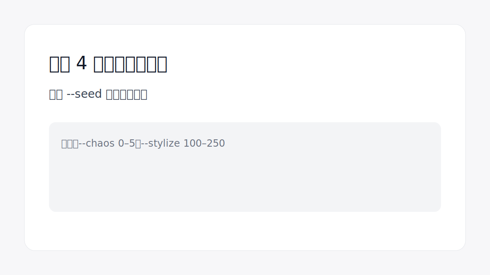

---

## 最容易踩的坑
1. 只有“高级、氛围、好看”，没有具体的主体、动作、场景和光线。
2. 没有参考图，或者 `--iw` 太低，构图和色调到处漂。
3. 每次都改一堆词，结果比对不出来。

---

## 先做三件事

### 用 Describe 找风格词
- 你给一张图，Describe 会吐出 4 组风格词和描述词。
- 同一张图多跑几次，差异会很明显，选最像的一组。

### 参考图先行
- 先放图链接，再写文字。
- 参考图是“锁构图”的，不是“写作文”的。

### `--iw` 控制强度
- 0.5–1.0：保持氛围，构图别绑死。
- 1.5–2.5：强锁构图/色调。
- 3.0：几乎以图为主，文字只是修边。

---

## 实操流程
1. 找一张和你目标**构图最接近**的参考图。
2. 先跑 Describe，挑 1–2 组最像的词。
3. 用“参考图 + 文字补充”的组合重新写 prompt。
4. `--iw` 从 1.2–1.8 起步。
5. 固定 `--seed`，只改一个变量，做 A/B。
6. 需要变化就加 `--chaos`，稳定就压到 0–10。

---

## 参数速查
- `--chaos` / `--c`：0–100，越大变化越多。
- `--stylize` / `--s`：0–1000，越大越艺术化，越不听话。
- `--seed`：锁随机起点，利于对比测试。
- `--stop`：10–100，早停让画面更松。
- `--no`：排除元素，用逗号分隔。
- `--weird` / `--w`：偏实验怪诞。
- `--sref`：风格参考图（URL 或 `https://s.mj.run/...`），控制画风/色调/材质走向。
- `--sw`：风格权重（0–1000），越高越像参考风格。
- `--iw`：图像权重（参考图“内容”影响强度），越高越贴参考图主体结构。

> 规则：参数放在 prompt 末尾，空格隔开。

---

## 提示词结构模板
```
主体 + 动作/状态 + 场景/背景 + 风格/媒介 + 光线/色调 + 镜头 + 构图 + 细节
```
示例：
```
亚洲女性摄影师在雨夜街头，霓虹灯反射，cinematic, photorealistic, soft rim light, shallow depth of field, 35mm, rule of thirds, high detail --ar 3:4 --s 200 --chaos 5
```

---

## 词库

### 画风词
- 写实摄影：photorealistic, cinematic, natural light, shallow depth of field, 35mm/50mm
- 插画平面：flat illustration, vector, clean lines, minimal, high contrast
- 手绘感：watercolor, pencil sketch, ink, hand-drawn, textured paper
- 动画二次元：anime style, cel shading, vibrant color, key visual
- 3D CG：octane render, ray tracing, subsurface scattering, soft global illumination
- 设计感：bauhaus, swiss typography, editorial layout, brutalist
- 中式氛围：oriental ink, xuan paper texture, misty mountains

### 光线词
- soft light, rim light, volumetric light, golden hour, neon glow

### 镜头词
- wide shot, close-up, 35mm, 50mm, 85mm, tilt shift

---

## 镜头词与光线词怎么写才有效

原则：先写镜头语义，再写光线语义，再补一句画面感觉，不要只堆词。

### 镜头词写法

1. 画面距离  
close-up / close shot：近景，强调脸部或细节  
用法：`close-up portrait, focus on eyes, shallow depth of field`

medium shot：半身，适合人像和产品  
用法：`medium shot, subject centered, clean background`

wide shot：全景，强调环境  
用法：`wide shot, subject small in frame, vast landscape`

2. 镜头焦段  
35mm：环境感强  
用法：`35mm, environmental portrait, cinematic`

50mm：通用人像  
用法：`50mm, natural perspective, soft background`

85mm：背景虚化强  
用法：`85mm, flattering portrait, creamy bokeh`

3. 构图写法  
rule of thirds：三分法  
用法：`rule of thirds, subject on left third`

centered：居中对称  
用法：`centered composition, symmetry`

top-down / overhead：俯拍  
用法：`top-down view, flat lay`

low angle：仰拍  
用法：`low angle shot, towering subject`

high angle：俯视  
用法：`high angle shot, small subject`

### 光线词写法

1. 主光类型  
soft light：柔光、皮肤质感好  
用法：`soft light, gentle shadows, smooth skin`

hard light：硬光、阴影明确  
用法：`hard light, sharp shadows, dramatic`

rim light：轮廓光  
用法：`rim light, glowing edges, separation from background`

backlight：逆光  
用法：`backlit, silhouette, glowing haze`

2. 时间与氛围  
golden hour：日落暖光  
用法：`golden hour, warm tones, sun flare`

blue hour：傍晚冷光  
用法：`blue hour, cool tones, soft gradient sky`

neon glow：霓虹灯  
用法：`neon glow, reflective surfaces, cyberpunk mood`

3. 空间光  
volumetric light：体积光  
用法：`volumetric light, visible light rays, dust in air`

ambient light：环境光  
用法：`ambient light, soft fill, low contrast`

### 组合示例

1. 人像写真  
`close-up portrait, 85mm, soft light, shallow depth of field, natural skin texture`

2. 城市夜景  
`wide shot, 35mm, neon glow, reflective wet street, cinematic mood`

3. 产品静物  
`top-down view, 50mm, soft light, clean shadows, minimal background`

4. 电影感场景  
`low angle shot, 35mm, backlight, volumetric light, dramatic atmosphere`

---

## 用 AI 能理解的描述语言

把抽象词换成画面描述，结果会更稳定：

- 抽象：`高级、氛围感`  
  替换：`soft light, shallow depth of field, muted colors, clean background`

- 抽象：`电影感`  
  替换：`35mm, cinematic lighting, strong contrast, film grain`

- 抽象：`高级质感`  
  替换：`matte texture, subtle highlights, low saturation`

## 具体打法

### 想要风格一致
- 用参考图 + `--iw` 1.5 起步。
- 固定 `--seed`，先别改别的。

### 想要构图一致
- 参考图必须和目标构图接近。
- 如果构图还是跑，`--iw` 拉高到 2.0。

### 想要更细节
- 先锁构图，再加细节。
- 细节词不要一口气堆 10 个，先加 2–3 个。

---

## 风格和提示词资源站
这些网站适合找风格、拆 prompt、抄参数：

- Midjourney Explore
  - https://www.midjourney.com/explore
- PromptHero
  - https://prompthero.com/midjourney
- PromptBase
  - https://promptbase.com/midjourney
- Midlibrary
  - https://www.midlibrary.io
- PromptFolder
  - https://promptfolder.com

---

## 配图示例
下面三张是我用上面的写法实际跑出来的示例，直接对照 prompt 看效果。

**示例 1 产品图（白底干净质感）**
提示词：`product centered, white seamless background, soft light, clean shadows, high detail, 50mm, minimal --ar 1:1 --v 7.0`
图片：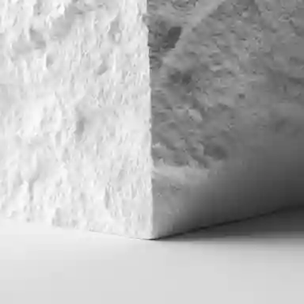

**示例 2 城市夜景（霓虹雨夜氛围）**
提示词：`rainy neon street at night, realistic cyberpunk city, wet asphalt reflections, wide angle 24mm, long exposure, volumetric light, teal and magenta glow --chaos 10 --ar 16:9 --stylize 200 --v 7.0`
图片：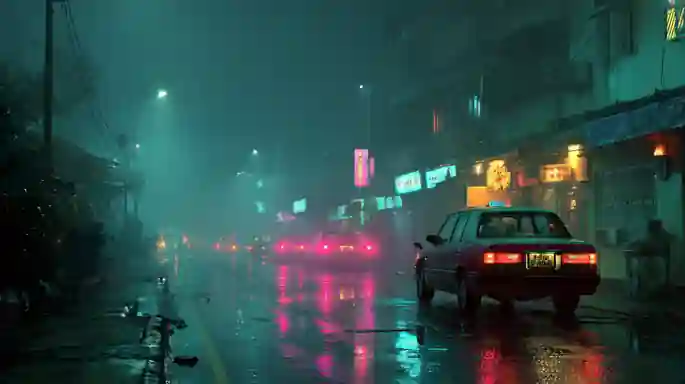

**示例 3 人像写真（85mm 电影感）**
提示词：`cinematic close-up portrait of a young Asian woman, soft rim light, shallow depth of field, 85mm lens, film grain, natural skin texture, muted teal and amber --chaos 5 --ar 2:3 --stylize 150 --v 7.0`
图片：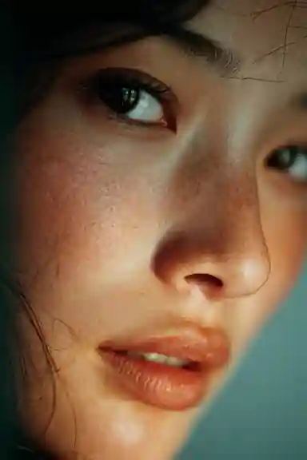

---

## 最短路径
1. 参考图 + Describe + `--iw 1.5`
2. 固定 `--seed` 只改一个变量
3. `--chaos` 先 0–5，稳定后再提高

---

## 常见场景模板（直接抄）

### 人像写真
```
close-up portrait, 85mm, soft light, shallow depth of field, natural skin texture, clean background --ar 3:4 --s 200 --chaos 3
```

### 城市夜景
```
wide shot, 35mm, neon glow, reflective wet street, cinematic mood, light haze --ar 16:9 --s 250 --chaos 5
```

### 室内静物
```
top-down view, 50mm, soft light, minimal background, clean shadows, matte texture --ar 4:5 --s 150 --chaos 2
```

### 产品主图（电商风）
```
product centered, 50mm, soft light, white seamless background, clean shadows, high detail --ar 1:1 --s 100 --chaos 0
```

---

## 想拍出你要的产品图：怎么写才“稳”

### 先把需求拆成 4 层
1. 产品本体：材质、颜色、形状、细节  
2. 环境与背景：纯白 / 场景 / 道具  
3. 光线：柔光 / 侧光 / 逆光 / 轮廓光  
4. 目的：电商主图 / 海报 / 社媒氛围图

### 通用公式
```
产品本体 + 材质/细节 + 背景 + 光线 + 镜头 + 构图 + 质感
```

### 可直接用的产品图模板

1. **电商白底主图**
```
product centered, white seamless background, soft light, clean shadows, high detail, 50mm, minimal --ar 1:1 --s 100 --chaos 0
```

2. **高端质感主图**
```
product centered, matte texture, subtle highlights, soft rim light, dark neutral background, 85mm, minimal --ar 4:5 --s 150 --chaos 2
```

3. **生活方式场景图**
```
product on a wooden table, natural light from window, warm tones, lifestyle setting, 35mm, shallow depth of field --ar 4:5 --s 200 --chaos 4
```

4. **科技感海报图**
```
product floating, neon glow, reflective surface, dark background, volumetric light, 35mm, cinematic --ar 16:9 --s 300 --chaos 6
```

### 想更像真实摄影的做法
- 固定 `--seed` 做对比  
- `--stylize` 不要过高（100–250）  
- 加上镜头 + 景深语义  
  - 例如：`85mm, shallow depth of field, soft light`

## 历史风格库（按风格归类，来自 Organize 全量）
以下为从历史 Create 自动归类的风格合集，每个风格给出若干条代表性提示词与对应历史图。

### 风格：3D渲染
3. 提示词：`3D rendering, C4D, cartoon style character, Hatake Kakashi, cute shape, solid color background, blind box toy style, blender, soft lighting effect, cartoon style character front view. --ar 1:1 --v 7.0`
图片：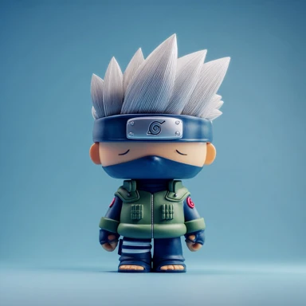
4. 提示词：`a simple design, a tarot card aesthetic, alphonse mucha style, and white digital art, Sailor Moon standing in front of the full moon, anime style, high contrast, dark background, silhouette lighting, dark colors, vector illustration, simple shapes, flat design, simple shadows, low details, high resolution, high detail, high quality, high definition, high sharpness, high focus, high clarity, hyper realistic, high octane render, photo real, hyper detailed, hyper realistic, hyper photorealistic, volumetric light, soft shadow, smooth shading, super detailed, very detailed, cinematic --ar 1:1 --v 7.0`
图片：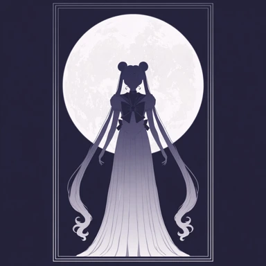
5. 提示词：`Model the word 'Cutie' in 3D using Blender with a style that incorporates soft colors like orange, purple, pink, or white. Make sure that the design is aesthetically pleasing and that the soft colors are harmoniously integrated into the three-dimensional representation of the word. Your creation should reflect creativity and originality, using the colors in a balanced way to achieve a visually pleasing effect. Please include details about the modeling techniques and the arrangement of colors in your description. --ar 1:1 --v 6.1`
图片：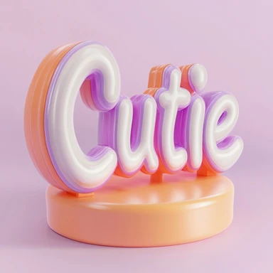
6. 提示词：`Pikachu floating mid-air with tiny red cape flowing, wearing Superman’s blue suit with chest emblem "S", glowing eyes and confident smile, maintaining Pikachu's original cute face and body shape, realistic fur texture, ultra detailed 3D render, cinematic lighting --ar 16:9 --quality 2 --raw --v 7.0`
图片：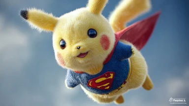

### 风格：产品图
1. 提示词：`product centered, white seamless background, soft light, clean shadows, high detail, 50mm, minimal --ar 1:1 --v 7.0`
图片：

### 风格：人像
1. 提示词：`cinematic close-up portrait of a young Asian woman, soft rim light, shallow depth of field, 85mm lens, film grain, natural skin texture, muted teal and amber --chaos 5 --ar 2:3 --stylize 150 --v 7.0`
图片：
2. 提示词：`product centered, white seamless background, soft light, clean shadows, high detail, 50mm, minimal --ar 1:1 --v 7.0`
图片：
4. 提示词：`2000s mirror selfie of a young adult woman. She has very long, voluminous dark wavy hair with soft wispy bangs, looking confident and slightly playful. She wears a fitted cream-white cropped t-shirt featuring a large cute anime-style cat face with big blue eyes, whiskers, and a small pink mouth. Her makeup is natural glam with soft pink dewy blush and glossy red pouty lips. Accessories include gold geometric hoop earrings and a silver waistchain. She holds a smartphone with a patterned case while taking the mirror selfie. Photographed in an early-2000s digital camera aesthetic, harsh super-flash lighting with bright blown-out highlights but the subject still clearly visible. Tight mirror-selfie composition, subtle grain, retro highlights, crisp details, soft shadows, V6 realism. Set in a nostalgic early-2000s bedroom with pastel-toned walls. Background elements include a chunky wooden dresser, a CD player, posters of 2000s pop icons, a hanging beaded door curtain, and a cluttered vanity with lip glosses. Retro atmosphere and lighting. --ar 3:4 --seed 1550392025 --raw --v 7.0 --sref 5089735182`
图片：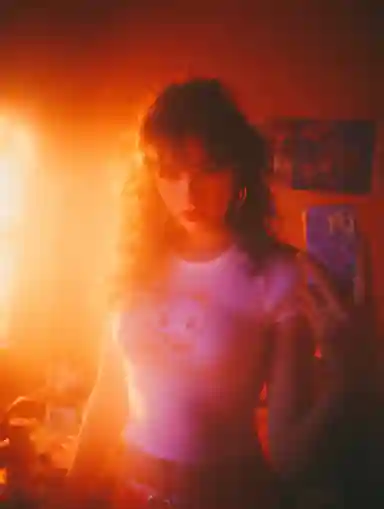
5. 提示词：`2000s mirror selfie of a young adult woman. She has very long, voluminous dark wavy hair with soft wispy bangs, looking confident and slightly playful. She wears a fitted cream-white cropped t-shirt featuring a large cute anime-style cat face with big blue eyes, whiskers, and a small pink mouth. Her makeup is natural glam with soft pink dewy blush and glossy red pouty lips. Accessories include gold geometric hoop earrings and a silver waistchain. She holds a smartphone with a patterned case while taking the mirror selfie. Photographed in an early-2000s digital camera aesthetic, harsh super-flash lighting with bright blown-out highlights but the subject still clearly visible. Tight mirror-selfie composition, subtle grain, retro highlights, crisp details, soft shadows, V6 realism. Set in a nostalgic early-2000s bedroom with pastel-toned walls. Background elements include a chunky wooden dresser, a CD player, posters of 2000s pop icons, a hanging beaded door curtain, and a cluttered vanity with lip glosses. Retro atmosphere and lighting. --ar 3:4 --seed 1550392025 --raw --v 7.0 --sref 4747488560`
图片：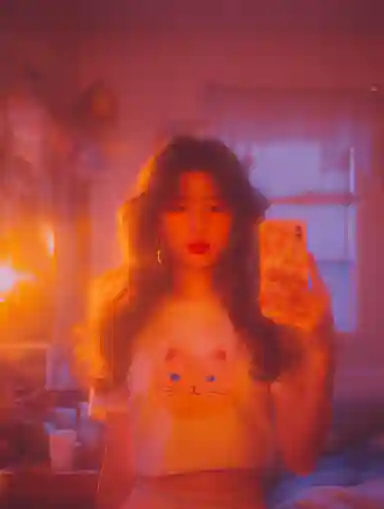
6. 提示词：`2000s mirror selfie of a young adult woman. She has very long, voluminous dark wavy hair with soft wispy bangs, looking confident and slightly playful. She wears a fitted cream-white cropped t-shirt featuring a large cute anime-style cat face with big blue eyes, whiskers, and a small pink mouth. Her makeup is natural glam with soft pink dewy blush and glossy red pouty lips. Accessories include gold geometric hoop earrings and a silver waistchain. She holds a smartphone with a patterned case while taking the mirror selfie. Photographed in an early-2000s digital camera aesthetic, harsh super-flash lighting with bright blown-out highlights but the subject still clearly visible. Tight mirror-selfie composition, subtle grain, retro highlights, crisp details, soft shadows, V6 realism. Set in a nostalgic early-2000s bedroom with pastel-toned walls. Background elements include a chunky wooden dresser, a CD player, posters of 2000s pop icons, a hanging beaded door curtain, and a cluttered vanity with lip glosses. Retro atmosphere and lighting. --ar 3:4 --seed 1550392025 --raw --v 7.0 --sref 4340848637`
图片：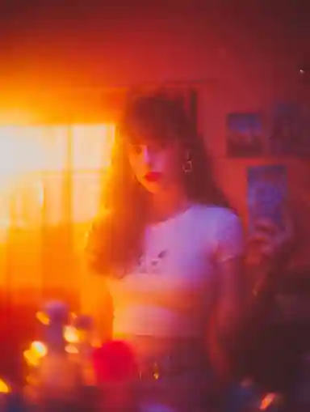

### 风格：像素风
1. 提示词：`pixel art, the back view of a boy standing in front of a large window, overlooking a breathtaking cityscape at dusk. The sky is filled with dramatic purple and pink sunset clouds, glowing softly like a Makoto Shinkai film. Neon signs flicker on nearby buildings. The city is calm but filled with subtle lights and depth. Cinematic composition, warm reflective lighting, retro-futuristic vibe, high-resolution pixel detailing --ar 1:2 --v 7.0`
图片：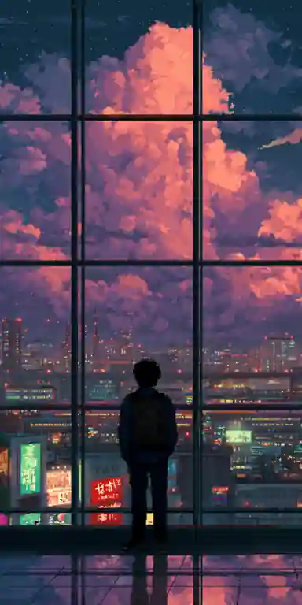
2. 提示词：`vibrant gaming background, bright blue gradient, dynamic burst rays, pixel art shapes, neon yellow lightning bolts, pink and yellow plus signs, floating retro game controllers, pixel blocks, stars and sparkles, modern cartoon style, 2D digital illustration, clean and vivid, seamless pattern, high resolution, no text, no characters, atmospheric depth, motion blur, cinematic lighting, cinematic style, atmospheric, hyperrealistic --ar 16:9 --v 7.0`
图片：
3. 提示词：`in high quality pixel art, a futuristic sports car speeds across a glowing, mirror-like road in a stylized icy mountain landscape; red and blue neon trails streak behind the vehicle as it races toward a radiant horizon under a crisp, deep blue sky; the scene is sleek and energetic, with a vibrant synthwave aesthetic --ar 16:9 --sref https://s.mj.run/jyJZBbPwCIQ --v 7.0`
图片：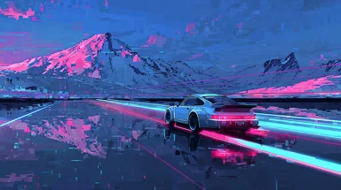
4. 提示词：`https://s.mj.run/2iy8zfZKC7Y Pixel art anime illustration, cozy indoor scene, 18-year-old girl lounging on a sofa, holding a smartphone with one hand, relaxed lazy posture, oversized sweatshirt and shorts, warm ambient lighting, cute sleeping cat curled up beside her, soft cushions and pastel décor, gentle color palette, clean lines, big expressive eyes, subtle cel-shading, wholesome and tranquil mood --ar 16:9 --v 7.0`
图片：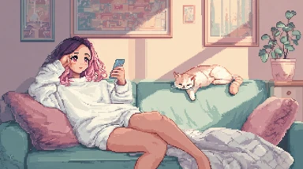
5. 提示词：`Hyper-detailed 8-bit pixel art, showing a tiny white kitten mid-crawling through a sizable round hole in a wooden textured wall. The kitten's body is visibly smaller than the hole (3:5 size ratio), front paws stretching outward with rear legs still inside the tunnel. Dust particles float around the protruding limbs. Warm amber backlight illuminates the tunnel entrance, casting long pixelated shadows. Cozy cat plush house partially visible in shallow depth of field with soft RGB lighting accents. --ar 16:9 --sref https://s.mj.run/ZQyUSFLZXk8 --v 7.0`
图片：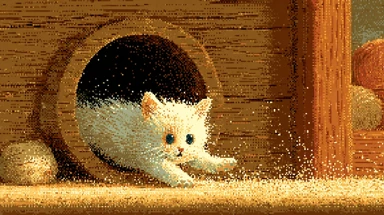
6. 提示词：`https://s.mj.run/ceTSFNJBVGs funny cat pixel art --ar 16:9 --profile yhk2agy --v 7.0`
图片：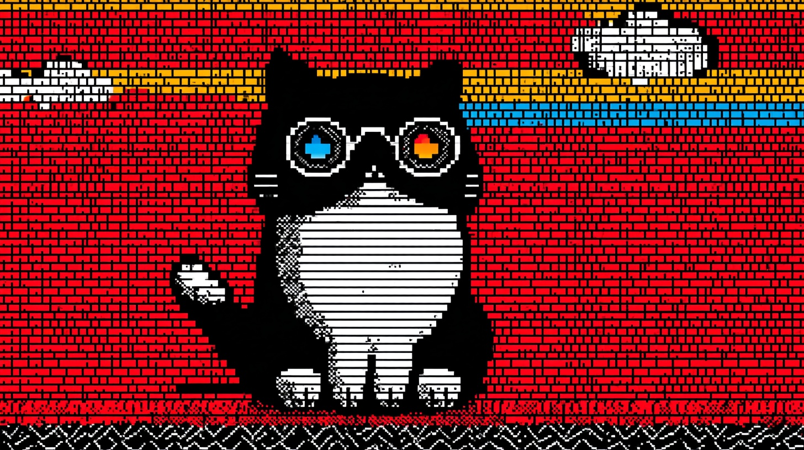

### 风格：其他
5. 提示词：`no hair --ar 1:2 --v 7.0`
图片：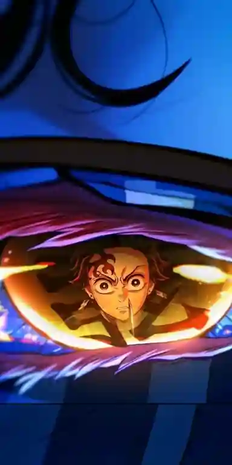
6. 提示词：`no hair --ar 1:2 --v 7.0`
图片：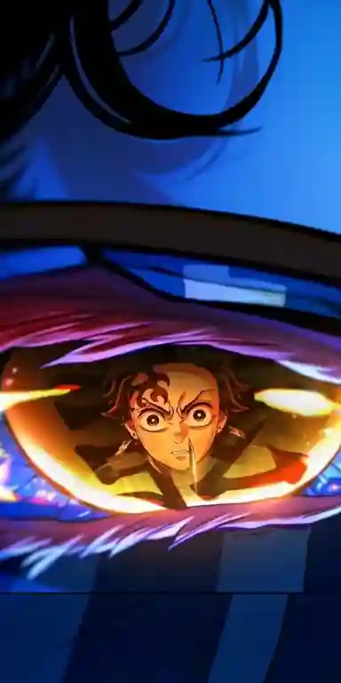

### 风格：动漫/二次元
1. 提示词：`2000s mirror selfie of a young adult woman. She has very long, voluminous dark wavy hair with soft wispy bangs, looking confident and slightly playful. She wears a fitted cream-white cropped t-shirt featuring a large cute anime-style cat face with big blue eyes, whiskers, and a small pink mouth. Her makeup is natural glam with soft pink dewy blush and glossy red pouty lips. Accessories include gold geometric hoop earrings and a silver waistchain. She holds a smartphone with a patterned case while taking the mirror selfie. Photographed in an early-2000s digital camera aesthetic, harsh super-flash lighting with bright blown-out highlights but the subject still clearly visible. Tight mirror-selfie composition, subtle grain, retro highlights, crisp details, soft shadows, V6 realism. Set in a nostalgic early-2000s bedroom with pastel-toned walls. Background elements include a chunky wooden dresser, a CD player, posters of 2000s pop icons, a hanging beaded door curtain, and a cluttered vanity with lip glosses. Retro atmosphere and lighting. --ar 3:4 --seed 1550392025 --raw --v 7.0 --sref 5089735182`
图片：
2. 提示词：`2000s mirror selfie of a young adult woman. She has very long, voluminous dark wavy hair with soft wispy bangs, looking confident and slightly playful. She wears a fitted cream-white cropped t-shirt featuring a large cute anime-style cat face with big blue eyes, whiskers, and a small pink mouth. Her makeup is natural glam with soft pink dewy blush and glossy red pouty lips. Accessories include gold geometric hoop earrings and a silver waistchain. She holds a smartphone with a patterned case while taking the mirror selfie. Photographed in an early-2000s digital camera aesthetic, harsh super-flash lighting with bright blown-out highlights but the subject still clearly visible. Tight mirror-selfie composition, subtle grain, retro highlights, crisp details, soft shadows, V6 realism. Set in a nostalgic early-2000s bedroom with pastel-toned walls. Background elements include a chunky wooden dresser, a CD player, posters of 2000s pop icons, a hanging beaded door curtain, and a cluttered vanity with lip glosses. Retro atmosphere and lighting. --ar 3:4 --seed 1550392025 --raw --v 7.0 --sref 4747488560`
图片：
3. 提示词：`2000s mirror selfie of a young adult woman. She has very long, voluminous dark wavy hair with soft wispy bangs, looking confident and slightly playful. She wears a fitted cream-white cropped t-shirt featuring a large cute anime-style cat face with big blue eyes, whiskers, and a small pink mouth. Her makeup is natural glam with soft pink dewy blush and glossy red pouty lips. Accessories include gold geometric hoop earrings and a silver waistchain. She holds a smartphone with a patterned case while taking the mirror selfie. Photographed in an early-2000s digital camera aesthetic, harsh super-flash lighting with bright blown-out highlights but the subject still clearly visible. Tight mirror-selfie composition, subtle grain, retro highlights, crisp details, soft shadows, V6 realism. Set in a nostalgic early-2000s bedroom with pastel-toned walls. Background elements include a chunky wooden dresser, a CD player, posters of 2000s pop icons, a hanging beaded door curtain, and a cluttered vanity with lip glosses. Retro atmosphere and lighting. --ar 3:4 --seed 1550392025 --raw --v 7.0 --sref 4340848637`
图片：
4. 提示词：`2000s mirror selfie of a young adult woman. She has very long, voluminous dark wavy hair with soft wispy bangs, looking confident and slightly playful. She wears a fitted cream-white cropped t-shirt featuring a large cute anime-style cat face with big blue eyes, whiskers, and a small pink mouth. Her makeup is natural glam with soft pink dewy blush and glossy red pouty lips. Accessories include gold geometric hoop earrings and a silver waistchain. She holds a smartphone with a patterned case while taking the mirror selfie. Photographed in an early-2000s digital camera aesthetic, harsh super-flash lighting with bright blown-out highlights but the subject still clearly visible. Tight mirror-selfie composition, subtle grain, retro highlights, crisp details, soft shadows, V6 realism. Set in a nostalgic early-2000s bedroom with pastel-toned walls. Background elements include a chunky wooden dresser, a CD player, posters of 2000s pop icons, a hanging beaded door curtain, and a cluttered vanity with lip glosses. Retro atmosphere and lighting. --ar 3:4 --seed 1550392025 --raw --v 7.0 --sref 5413739541`
图片：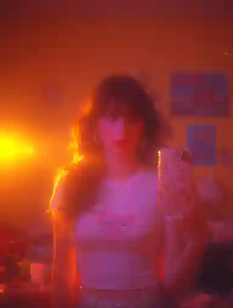
5. 提示词：`2000s mirror selfie of a young adult woman. She has very long, voluminous dark wavy hair with soft wispy bangs, looking confident and slightly playful. She wears a fitted cream-white cropped t-shirt featuring a large cute anime-style cat face with big blue eyes, whiskers, and a small pink mouth. Her makeup is natural glam with soft pink dewy blush and glossy red pouty lips. Accessories include gold geometric hoop earrings and a silver waistchain. She holds a smartphone with a patterned case while taking the mirror selfie. Photographed in an early-2000s digital camera aesthetic, harsh super-flash lighting with bright blown-out highlights but the subject still clearly visible. Tight mirror-selfie composition, subtle grain, retro highlights, crisp details, soft shadows, V6 realism. Set in a nostalgic early-2000s bedroom with pastel-toned walls. Background elements include a chunky wooden dresser, a CD player, posters of 2000s pop icons, a hanging beaded door curtain, and a cluttered vanity with lip glosses. Retro atmosphere and lighting. --ar 3:4 --seed 1550392025 --raw --v 7.0 --sref 7760050381`
图片：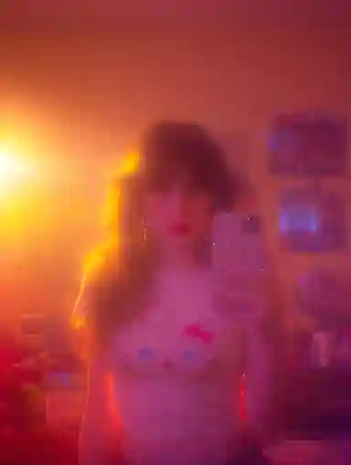
6. 提示词：`2000s mirror selfie of a young adult woman. She has very long, voluminous dark wavy hair with soft wispy bangs, looking confident and slightly playful. She wears a fitted cream-white cropped t-shirt featuring a large cute anime-style cat face with big blue eyes, whiskers, and a small pink mouth. Her makeup is natural glam with soft pink dewy blush and glossy red pouty lips. Accessories include gold geometric hoop earrings and a silver waistchain. She holds a smartphone with a patterned case while taking the mirror selfie. Photographed in an early-2000s digital camera aesthetic, harsh super-flash lighting with bright blown-out highlights but the subject still clearly visible. Tight mirror-selfie composition, subtle grain, retro highlights, crisp details, soft shadows, V6 realism. Set in a nostalgic early-2000s bedroom with pastel-toned walls. Background elements include a chunky wooden dresser, a CD player, posters of 2000s pop icons, a hanging beaded door curtain, and a cluttered vanity with lip glosses. Retro atmosphere and lighting. --ar 3:4 --seed 1550392025 --raw --v 7.0 --sref 6778148313`
图片：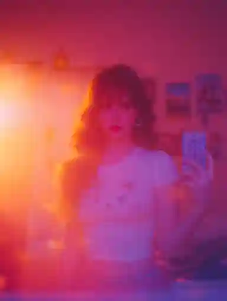

### 风格：城市夜景
1. 提示词：`rainy neon street at night, realistic cyberpunk city, wet asphalt reflections, wide angle 24mm, long exposure, volumetric light, teal and magenta glow --chaos 10 --ar 16:9 --stylize 200 --v 7.0`
图片：
3. 提示词：`a cute anime cat girl she is wearing heart shaped glasses and holding pills in her open hands. The background is an American suburb street on fire with pink flames. There is pink smoke everywhere, anime 8 bit style. Dreamy atmosphere. --ar 1:2 --v 7.0`
图片：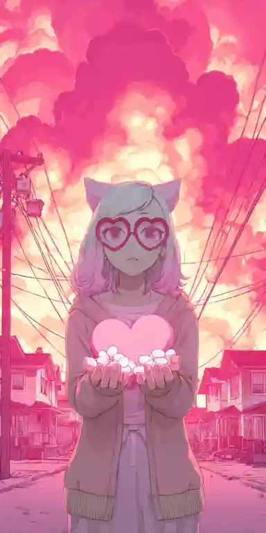
4. 提示词：`VIDEO, A looping 90s anime aesthetic scene, soft pastel colors, VHS film grain, dreamy sunset sky with pink and purple hues, retro Japanese cityscape with neon signs, palm trees swaying gently, nostalgic vibe, vaporwave and lo-fi atmosphere, smooth animation style, cinematic composition, relaxing mood, designed for background video use --ar 1:2 --v 7.0`
图片：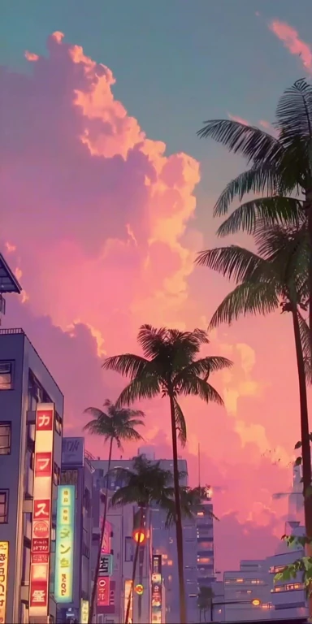
5. 提示词：`girl standing on the rooftop of a Japanese residential building, view of quiet city streets with power lines and wet asphalt after rain, holding phone in her hands, melancholic atmosphere, anime cinematic style, soft lighting, reflective surfaces, detailed background --ar 1:2 --profile 5icawrw n1jox3a hhal267 --v 7.0`
图片：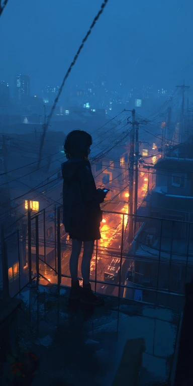
6. 提示词：`cityscape with magical girl theme, Sailor Moon-inspired, cute and nostalgic, whimsical details, pastel colors, moonlit sky, anime style, enchanting atmosphere --ar 1:2 --profile 7pzb4fp --v 7.0`
图片：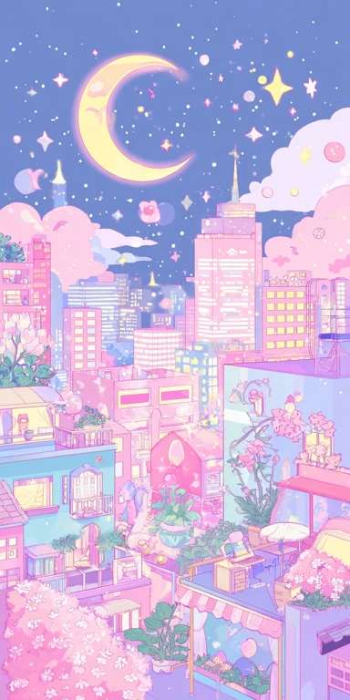

### 风格：建筑/室内
1. 提示词：`a majestic Japanese palace floating gently among golden clouds at sunset, multi-tiered rooftops lined with glowing golden ornaments, silk banners fluttering from tall spires, camera positioned from inside a quiet balcony hallway, warm crimson and orange light flooding through open paper screens, polished wooden floors reflecting faint light, wind gently pushing open paper doors, the horizon stretching infinitely above the clouds, birds circling the palace in slow arcs, soft lens flares, golden atmosphere full of silence and awe, long shadows stretching across architecture, anime Ghibli-style high fantasy realism, layered depth, motion blur on banners, distant glowing lanterns rising slowly --ar 1:2 --quality 2 --raw --stylize 250 --v 7.0`
图片：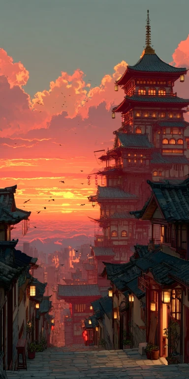
2. 提示词：`anime-style ultra-detailed scene from elevated viewpoint, two teenagers (boy and girl) standing on a wide stairway in foreground, overlooking a massive futuristic coastal city, realistic proportions and scale, densely layered sci-fi buildings with visible pipes, walkways and towers, floating orbital rings and skybridges above, tropical trees and crowds in a large public plaza below, clean ocean in background, bright cumulus clouds in a deep sky, sharp architectural lighting, cinematic atmosphere, hyper-real textures, global illumination, volumetric light, painterly finish, inspired by Makoto Shinkai + Katsuhiro Otomo --ar 1:2 --quality 2 --raw --v 7.0`
图片：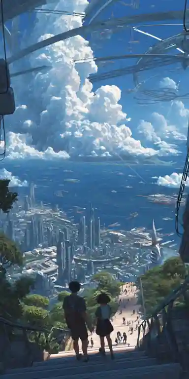
3. 提示词：`2D flat White butterfly silhouette on a green background, soft tonal shades of color in the pattern, minimalist design with simple shapes and clean lines They appear as abstract silhouettes, giving the design a vintage feel. This print is suitable for interior decoration or fashion printing, and it embodies high-end aesthetics. --ar 16:9 --profile q7k1bgj --v 7.0`
图片：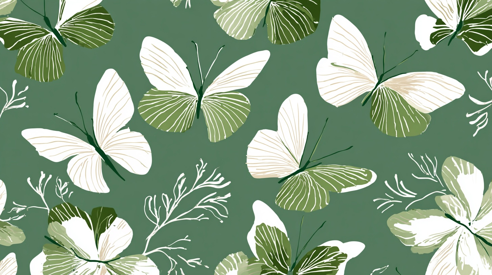
4. 提示词：`https://s.mj.run/Mzgh3BCGu8M 2D flat White butterfly silhouette on a yellow background, soft tonal shades of color in the pattern, minimalist design with simple shapes and clean lines. They appear as abstract silhouettes, giving the design a vintage feel. This print is suitable for interior decoration or fashion printing, and it embodies high-end aesthetics. --ar 16:9 --profile q7k1bgj --v 7.0`
图片：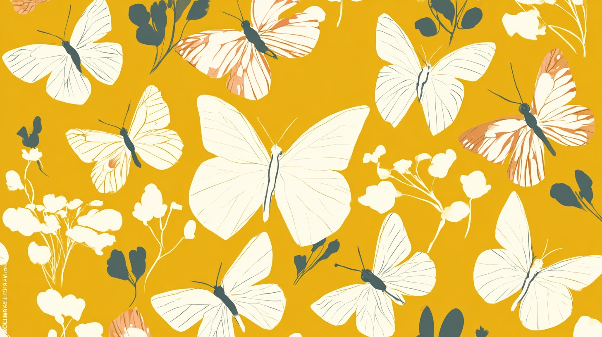
5. 提示词：`https://s.mj.run/g9hXlgM4-ok interior perspective of a futuristic garage illuminated with ethereal colored light fields, inspired by James Turrell’s immersive light installations the space features a fractal tectonic architecture with chamfered walls, layered light apertures, and crystalline volumetric geometry inside, a diverse collection of Japanese street race cars with intricate vinyl decals, widebody kits, glowing underglow, and carbon fiber spoilers each car a unique livery with vibrant color palettes, kanji text, and cyberpunk motifs the floor reflects ambient lighting, rendered in Octane with soft volumetric glow, painterly atmosphere, and cinematic framing sacred geometry meets urban underground energy, a surreal fusion of luminous color and mechanical detail --ar 16:9 --profile 422jmgv --stylize 50 --v 7.0`
图片：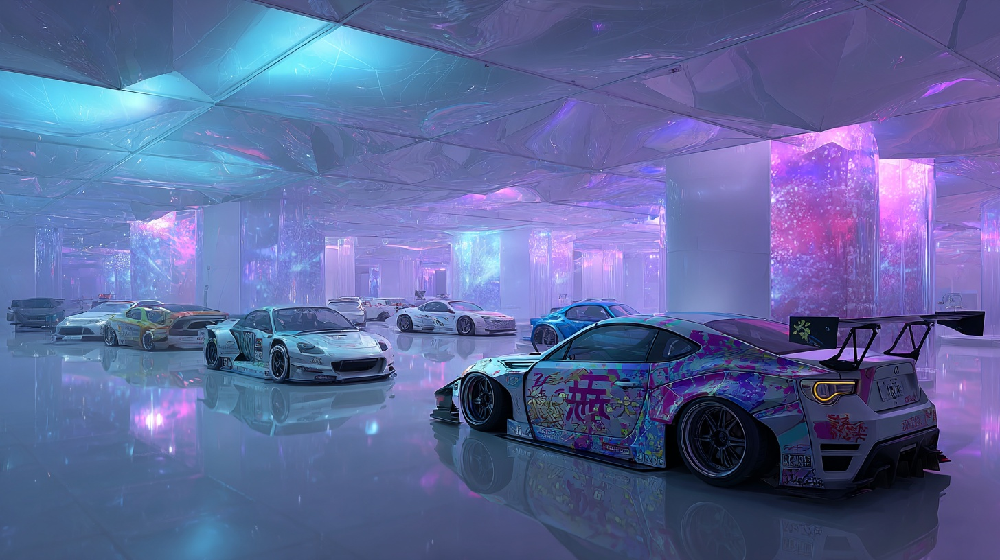
6. 提示词：`top-down aerial view of a futuristic 3D race track, sleek curves and advanced architecture, soft matte purple surface, subtle gradients, minimalistic design a metallic high-tech race car on the track, stylized and aerodynamic, chrome and violet reflections, dramatic lighting and shadows, cinematic composition, modern sci-fi art style, ultra detailed, octane render --ar 16:9 --sref https://s.mj.run/kC_MHbNWehc --v 7.0`
图片：

### 风格：摄影
1. 提示词：`2000s mirror selfie of a young adult woman. She has very long, voluminous dark wavy hair with soft wispy bangs, looking confident and slightly playful. She wears a fitted cream-white cropped t-shirt featuring a large cute anime-style cat face with big blue eyes, whiskers, and a small pink mouth. Her makeup is natural glam with soft pink dewy blush and glossy red pouty lips. Accessories include gold geometric hoop earrings and a silver waistchain. She holds a smartphone with a patterned case while taking the mirror selfie. Photographed in an early-2000s digital camera aesthetic, harsh super-flash lighting with bright blown-out highlights but the subject still clearly visible. Tight mirror-selfie composition, subtle grain, retro highlights, crisp details, soft shadows, V6 realism. Set in a nostalgic early-2000s bedroom with pastel-toned walls. Background elements include a chunky wooden dresser, a CD player, posters of 2000s pop icons, a hanging beaded door curtain, and a cluttered vanity with lip glosses. Retro atmosphere and lighting. --ar 3:4 --seed 1550392025 --raw --v 7.0 --sref 5089735182`
图片：
2. 提示词：`2000s mirror selfie of a young adult woman. She has very long, voluminous dark wavy hair with soft wispy bangs, looking confident and slightly playful. She wears a fitted cream-white cropped t-shirt featuring a large cute anime-style cat face with big blue eyes, whiskers, and a small pink mouth. Her makeup is natural glam with soft pink dewy blush and glossy red pouty lips. Accessories include gold geometric hoop earrings and a silver waistchain. She holds a smartphone with a patterned case while taking the mirror selfie. Photographed in an early-2000s digital camera aesthetic, harsh super-flash lighting with bright blown-out highlights but the subject still clearly visible. Tight mirror-selfie composition, subtle grain, retro highlights, crisp details, soft shadows, V6 realism. Set in a nostalgic early-2000s bedroom with pastel-toned walls. Background elements include a chunky wooden dresser, a CD player, posters of 2000s pop icons, a hanging beaded door curtain, and a cluttered vanity with lip glosses. Retro atmosphere and lighting. --ar 3:4 --seed 1550392025 --raw --v 7.0 --sref 4747488560`
图片：
3. 提示词：`2000s mirror selfie of a young adult woman. She has very long, voluminous dark wavy hair with soft wispy bangs, looking confident and slightly playful. She wears a fitted cream-white cropped t-shirt featuring a large cute anime-style cat face with big blue eyes, whiskers, and a small pink mouth. Her makeup is natural glam with soft pink dewy blush and glossy red pouty lips. Accessories include gold geometric hoop earrings and a silver waistchain. She holds a smartphone with a patterned case while taking the mirror selfie. Photographed in an early-2000s digital camera aesthetic, harsh super-flash lighting with bright blown-out highlights but the subject still clearly visible. Tight mirror-selfie composition, subtle grain, retro highlights, crisp details, soft shadows, V6 realism. Set in a nostalgic early-2000s bedroom with pastel-toned walls. Background elements include a chunky wooden dresser, a CD player, posters of 2000s pop icons, a hanging beaded door curtain, and a cluttered vanity with lip glosses. Retro atmosphere and lighting. --ar 3:4 --seed 1550392025 --raw --v 7.0 --sref 4340848637`
图片：
4. 提示词：`2000s mirror selfie of a young adult woman. She has very long, voluminous dark wavy hair with soft wispy bangs, looking confident and slightly playful. She wears a fitted cream-white cropped t-shirt featuring a large cute anime-style cat face with big blue eyes, whiskers, and a small pink mouth. Her makeup is natural glam with soft pink dewy blush and glossy red pouty lips. Accessories include gold geometric hoop earrings and a silver waistchain. She holds a smartphone with a patterned case while taking the mirror selfie. Photographed in an early-2000s digital camera aesthetic, harsh super-flash lighting with bright blown-out highlights but the subject still clearly visible. Tight mirror-selfie composition, subtle grain, retro highlights, crisp details, soft shadows, V6 realism. Set in a nostalgic early-2000s bedroom with pastel-toned walls. Background elements include a chunky wooden dresser, a CD player, posters of 2000s pop icons, a hanging beaded door curtain, and a cluttered vanity with lip glosses. Retro atmosphere and lighting. --ar 3:4 --seed 1550392025 --raw --v 7.0 --sref 5413739541`
图片：
5. 提示词：`2000s mirror selfie of a young adult woman. She has very long, voluminous dark wavy hair with soft wispy bangs, looking confident and slightly playful. She wears a fitted cream-white cropped t-shirt featuring a large cute anime-style cat face with big blue eyes, whiskers, and a small pink mouth. Her makeup is natural glam with soft pink dewy blush and glossy red pouty lips. Accessories include gold geometric hoop earrings and a silver waistchain. She holds a smartphone with a patterned case while taking the mirror selfie. Photographed in an early-2000s digital camera aesthetic, harsh super-flash lighting with bright blown-out highlights but the subject still clearly visible. Tight mirror-selfie composition, subtle grain, retro highlights, crisp details, soft shadows, V6 realism. Set in a nostalgic early-2000s bedroom with pastel-toned walls. Background elements include a chunky wooden dresser, a CD player, posters of 2000s pop icons, a hanging beaded door curtain, and a cluttered vanity with lip glosses. Retro atmosphere and lighting. --ar 3:4 --seed 1550392025 --raw --v 7.0 --sref 7760050381`
图片：
6. 提示词：`2000s mirror selfie of a young adult woman. She has very long, voluminous dark wavy hair with soft wispy bangs, looking confident and slightly playful. She wears a fitted cream-white cropped t-shirt featuring a large cute anime-style cat face with big blue eyes, whiskers, and a small pink mouth. Her makeup is natural glam with soft pink dewy blush and glossy red pouty lips. Accessories include gold geometric hoop earrings and a silver waistchain. She holds a smartphone with a patterned case while taking the mirror selfie. Photographed in an early-2000s digital camera aesthetic, harsh super-flash lighting with bright blown-out highlights but the subject still clearly visible. Tight mirror-selfie composition, subtle grain, retro highlights, crisp details, soft shadows, V6 realism. Set in a nostalgic early-2000s bedroom with pastel-toned walls. Background elements include a chunky wooden dresser, a CD player, posters of 2000s pop icons, a hanging beaded door curtain, and a cluttered vanity with lip glosses. Retro atmosphere and lighting. --ar 3:4 --seed 1550392025 --raw --v 7.0 --sref 6778148313`
图片：

### 风格：未来科技
6. 提示词：`in a dreamy pastel galaxy space, and the water surface sparkles. The soft, gentle colors, mainly pastel (pink, lavender, baby blue), are the greatest attraction. The overall tone is soft, blurred. Clouds and countless stars float around the planet. A soft spatial design makes use of a floating feeling, depth, and blur. The entire screen shines with soft lighting that makes use of a glow effect. A Y2K sweet fantasy. A sense of transparency. Covered in clouds. --ar 1:2 --raw --profile 844ij6g --stylize 150 --v 7.0`
图片：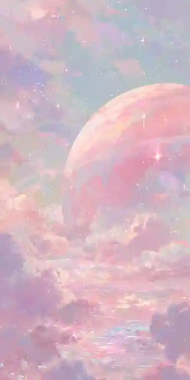

### 风格：材质/纹理
1. 提示词：`cinematic close-up portrait of a young Asian woman, soft rim light, shallow depth of field, 85mm lens, film grain, natural skin texture, muted teal and amber --chaos 5 --ar 2:3 --stylize 150 --v 7.0`
图片：

### 风格：极简/留白
1. 提示词：`product centered, white seamless background, soft light, clean shadows, high detail, 50mm, minimal --ar 1:1 --v 7.0`
图片：

### 风格：水彩
1. 提示词：`Hatsune Miku, soft watercolor anime illustration, delicate brush strokes, turquoise twin tails flowing, dreamy pose, glowing eyes, minimal soft pastel background with subtle watercolor textures, elegant and artistic, designed for mousepad --ar 16:9 --stylize 200 --v 6.1`
图片：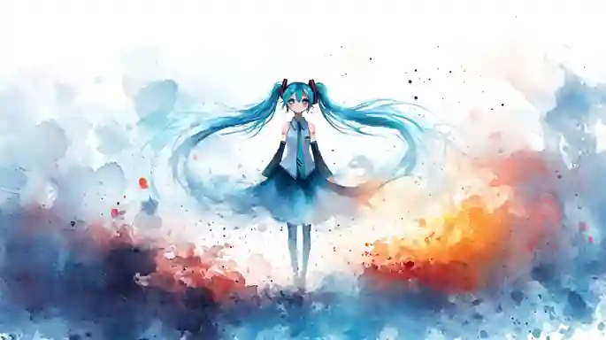
2. 提示词：`cut cat, watercolor style minimalism, working on laptop with headphones on, miniature design --ar 16:9 --v 7.0`
图片：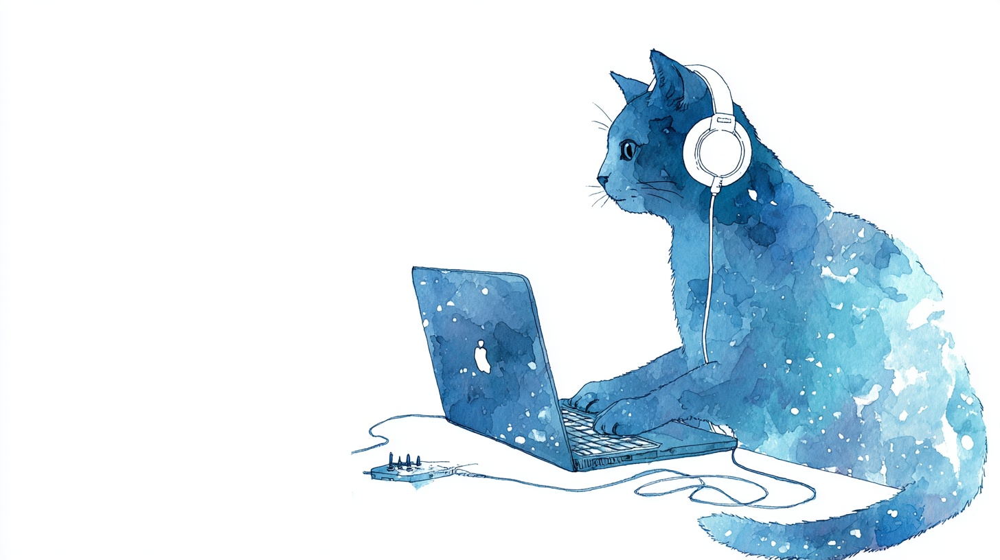
3. 提示词：`cut cat, watercolor style minimalism, working on laptop with headphones on, miniature design --ar 16:9 --v 7.0`
图片：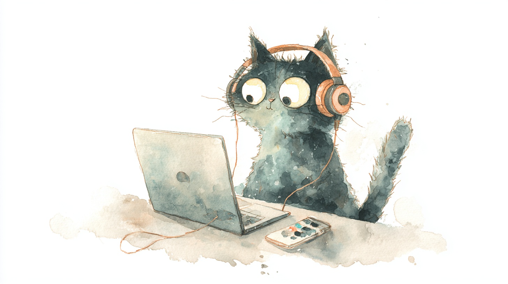
4. 提示词：`cut cat, watercolor style minimalism, working on laptop with headphones on, miniature design --ar 16:9 --v 7.0`
图片：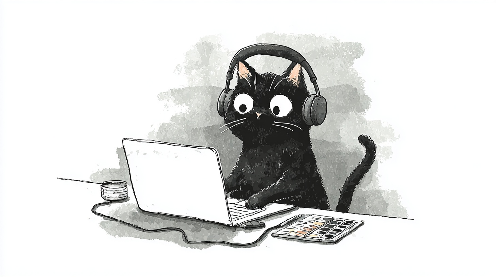
5. 提示词：`cut cat, watercolor style minimalism, working on laptop with headphones on, miniature design --ar 16:9 --v 7.0`
图片：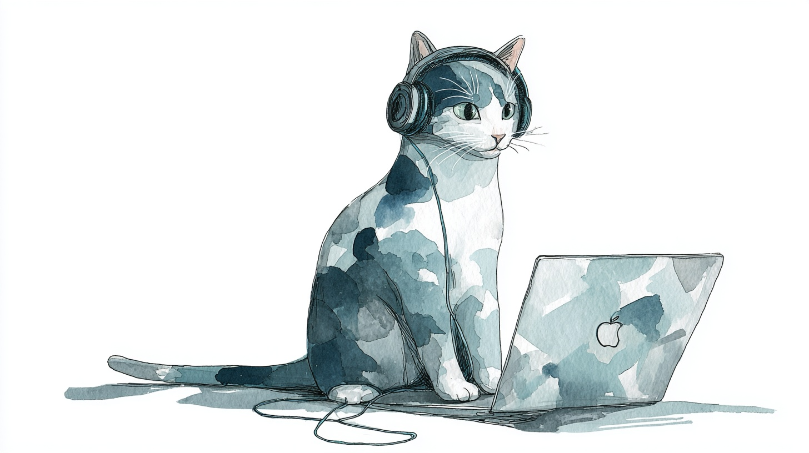
6. 提示词：`cut cat, watercolor style minimalism, working on laptop with headphones on, miniature design --ar 16:9 --v 7.0`
图片：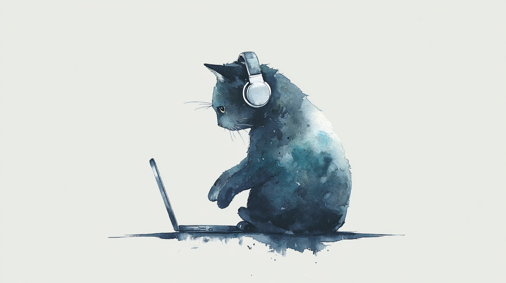

### 风格：油画
1. 提示词：`oil painting --ar 47:25 --v 7.0`
图片：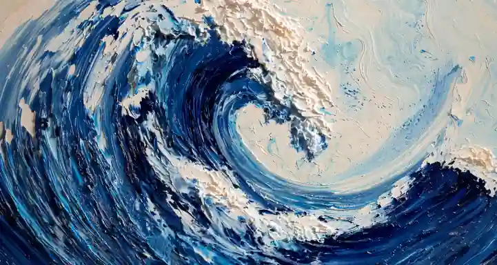
2. 提示词：`Van Gogh-inspired artistic t-shirt design of a black silhouette of a cat sitting on a hill, gazing at a swirling night sky painted in bold brush strokes. The background is reminiscent of "Starry Night" with swirling patterns and luminous stars in shades of yellow, blue, and white. Below the hill, a village with glowing yellow-lit windows rests under the sky. The color palette is deep and rich, creating a dreamy, contemplative atmosphere. The entire scene is isolated on a black background. --chaos 10 --ar 1:1 --raw --sref https://s.mj.run/VDhBvO7IAM4 --v 7.0`
图片：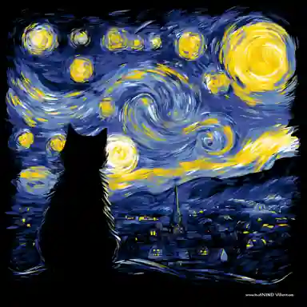
3. 提示词：`cute cat sits on a boat on a calm lake loaded with star shaped led lights looking up at the stars in the style of Van Gogh. The background is a deep blue sky with white and yellow lights swirling in the sky like a starry night. With its thick black lines and bright colors, the work is a typical Impressionist artwork. The painting highlights the contrast between light and dark, and uses bright colors to create depth and three-dimensionality. Translated with DeepL.com (free version) --ar 1:1 --sref https://s.mj.run/Lw0ESDw_zUg --stylize 50 --v 7.0`
图片：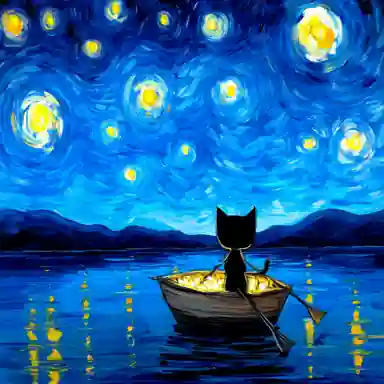
4. 提示词：`Van Goghstyle flower --ar 94:49 --v 7.0`
图片：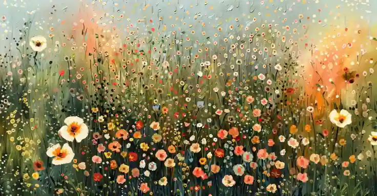
5. 提示词：`The cute black cat is happily waving fluorescent sticks with its hands. With headphones on the neck，Wearing fluorescent contrast-colored short-sleeved shirts，he background is a starry sky and musical notes, comic oil painting style, Pantone Cool Blue background, dynamic splatter acrylic effect, vivid purple and cyan background, wwnmemo surrealism， depth of field --ar 1:1 --v 7.0`
图片：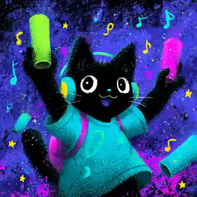
6. 提示词：`cute black cat, oil painting, abstract --ar 16:9 --sref https://s.mj.run/aNLvOhyyTQs --v 7.0`
图片：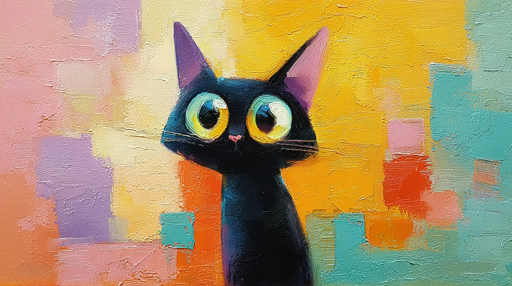

### 风格：海报/版式
4. 提示词：`2000s mirror selfie of a young adult woman. She has very long, voluminous dark wavy hair with soft wispy bangs, looking confident and slightly playful. She wears a fitted cream-white cropped t-shirt featuring a large cute anime-style cat face with big blue eyes, whiskers, and a small pink mouth. Her makeup is natural glam with soft pink dewy blush and glossy red pouty lips. Accessories include gold geometric hoop earrings and a silver waistchain. She holds a smartphone with a patterned case while taking the mirror selfie. Photographed in an early-2000s digital camera aesthetic, harsh super-flash lighting with bright blown-out highlights but the subject still clearly visible. Tight mirror-selfie composition, subtle grain, retro highlights, crisp details, soft shadows, V6 realism. Set in a nostalgic early-2000s bedroom with pastel-toned walls. Background elements include a chunky wooden dresser, a CD player, posters of 2000s pop icons, a hanging beaded door curtain, and a cluttered vanity with lip glosses. Retro atmosphere and lighting. --ar 3:4 --seed 1550392025 --raw --v 7.0 --sref 5089735182`
图片：
5. 提示词：`2000s mirror selfie of a young adult woman. She has very long, voluminous dark wavy hair with soft wispy bangs, looking confident and slightly playful. She wears a fitted cream-white cropped t-shirt featuring a large cute anime-style cat face with big blue eyes, whiskers, and a small pink mouth. Her makeup is natural glam with soft pink dewy blush and glossy red pouty lips. Accessories include gold geometric hoop earrings and a silver waistchain. She holds a smartphone with a patterned case while taking the mirror selfie. Photographed in an early-2000s digital camera aesthetic, harsh super-flash lighting with bright blown-out highlights but the subject still clearly visible. Tight mirror-selfie composition, subtle grain, retro highlights, crisp details, soft shadows, V6 realism. Set in a nostalgic early-2000s bedroom with pastel-toned walls. Background elements include a chunky wooden dresser, a CD player, posters of 2000s pop icons, a hanging beaded door curtain, and a cluttered vanity with lip glosses. Retro atmosphere and lighting. --ar 3:4 --seed 1550392025 --raw --v 7.0 --sref 4747488560`
图片：
6. 提示词：`2000s mirror selfie of a young adult woman. She has very long, voluminous dark wavy hair with soft wispy bangs, looking confident and slightly playful. She wears a fitted cream-white cropped t-shirt featuring a large cute anime-style cat face with big blue eyes, whiskers, and a small pink mouth. Her makeup is natural glam with soft pink dewy blush and glossy red pouty lips. Accessories include gold geometric hoop earrings and a silver waistchain. She holds a smartphone with a patterned case while taking the mirror selfie. Photographed in an early-2000s digital camera aesthetic, harsh super-flash lighting with bright blown-out highlights but the subject still clearly visible. Tight mirror-selfie composition, subtle grain, retro highlights, crisp details, soft shadows, V6 realism. Set in a nostalgic early-2000s bedroom with pastel-toned walls. Background elements include a chunky wooden dresser, a CD player, posters of 2000s pop icons, a hanging beaded door curtain, and a cluttered vanity with lip glosses. Retro atmosphere and lighting. --ar 3:4 --seed 1550392025 --raw --v 7.0 --sref 4340848637`
图片：

### 风格：电影感
1. 提示词：`cinematic close-up portrait of a young Asian woman, soft rim light, shallow depth of field, 85mm lens, film grain, natural skin texture, muted teal and amber --chaos 5 --ar 2:3 --stylize 150 --v 7.0`
图片：
2. 提示词：`rainy neon street at night, realistic cyberpunk city, wet asphalt reflections, wide angle 24mm, long exposure, volumetric light, teal and magenta glow --chaos 10 --ar 16:9 --stylize 200 --v 7.0`
图片：
3. 提示词：`VIDEO, A looping 90s anime aesthetic scene, soft pastel colors, VHS film grain, dreamy sunset sky with pink and purple hues, retro Japanese cityscape with neon signs, palm trees swaying gently, nostalgic vibe, vaporwave and lo-fi atmosphere, smooth animation style, cinematic composition, relaxing mood, designed for background video use --ar 1:2 --v 7.0`
图片：
4. 提示词：`A lone anime boy stands quietly beside a narrow countryside train track at twilight, gazing at a pink and purple sky glowing with soft starlight and scattered clouds. A vintage train signal and overhead wires frame the horizon. The fields around are shaded in deep lavender tones, and gentle fireflies float above the grass. The lighting is emotional and cinematic, with a painterly anime aesthetic, inspired by Ghibli. --chaos 15 --ar 1:2 --stylize 300 --v 7.0`
图片：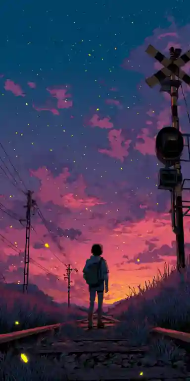
5. 提示词：`girl standing on the rooftop of a Japanese residential building, view of quiet city streets with power lines and wet asphalt after rain, holding phone in her hands, melancholic atmosphere, anime cinematic style, soft lighting, reflective surfaces, detailed background --ar 1:2 --profile 5icawrw n1jox3a hhal267 --v 7.0`
图片：
6. 提示词：`A Japanese city transformed into a mirror world, roads and buildings reflecting perfectly, sky mirrored on the ground, cafes and people floating as reflections, dramatic glowing lights, surreal and cinematic atmosphere, vibrant colors, whimsical and painterly style, inspired by Makoto Shinkai and Studio Ghibli --ar 1:2 --quality 2 --v 7.0`
图片：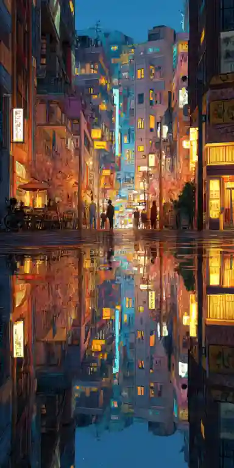

### 风格：等距/轴测
1. 提示词：`A vector icon of an electric sports car, blue and purple with a white background, simple design, in a cartoon style, for the game world in Rainbow Six Siege, Fortnite, cartoon realism, isometric view, side profile, minimalistic design, simple shape, low detail, solid black color background, no shadows. --ar 16:9 --v 7.0`
图片：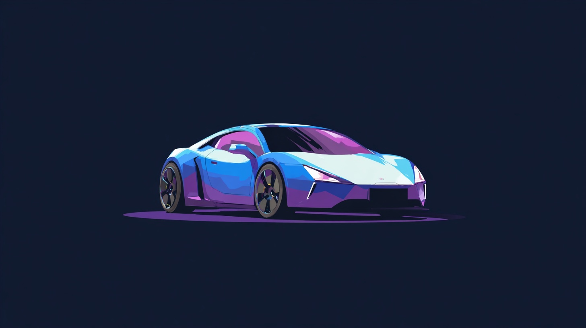
2. 提示词：`A set of round thin glass with orange gradient color, superimposed on each other, forming an abstract circular trajectory, floating in the air, the glass is a soft orange and white gradient, the background is white, simple, and the light shines from behind it. Surreal style, floating shapes, minimalist design, linear illustration, sun-like tones, holographic colors, white background, isometric view, 3D rendering, Cinema 4D rendering, Blender rendering, Octane rendering --ar 16:9 --v 7.0`
图片：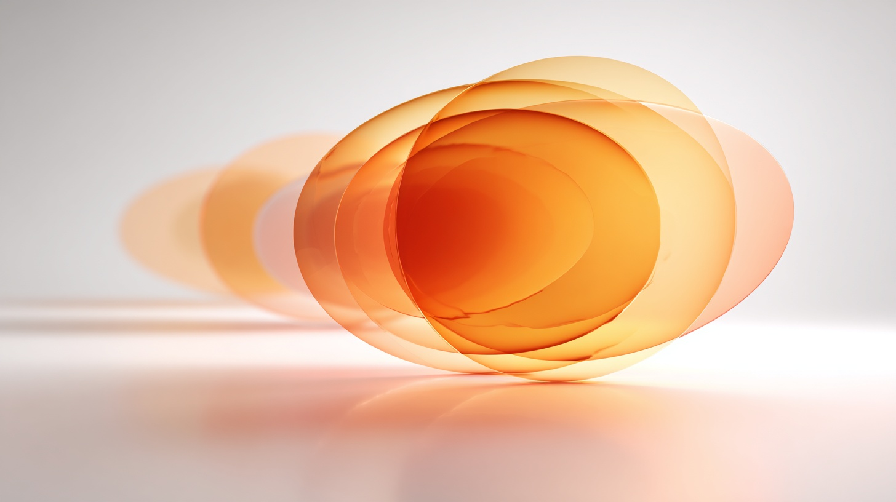
3. 提示词：`https://s.mj.run/kWV0KCyLujU a high-definition 3d abstract representation of a glowing isometric atom with swirling electrons and glowing soundwaves on a a navy blue background --ar 16:9 --raw --v 7.0`
图片：
4. 提示词：`a high-definition 3d abstract representation of a glowing isometric atom with swirling electrons and glowing soundwaves on a a navy blue background --ar 16:9 --raw --v 7.0`
图片：
5. 提示词：`https://s.mj.run/8--4j4Tv1UE Oil Painting, brush strokes. isometric view. field of wildflowers with small black cartoon cat in the bottom third of the image peeking out at us from the wildflowers, the cat is wearing a small straw sun hat, the cat's ears are poking through the top of the sun hat. This entire image is done in mary blair style --ar 16:9 --v 7.0`
图片：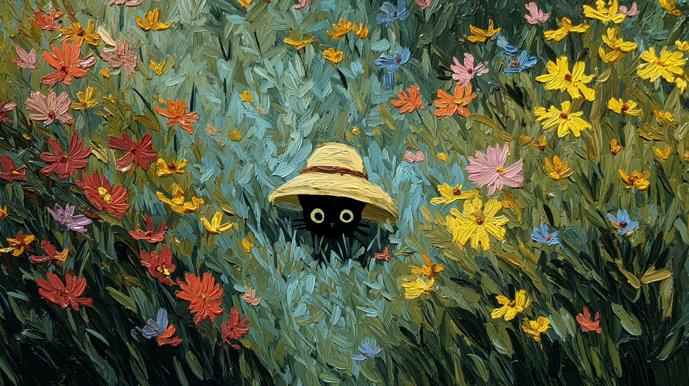
6. 提示词：`https://s.mj.run/OqynEE3KDvo a simple design, a tarot card aesthetic, alphonse mucha style, watercolor designed, front face centered image,close up face and body length detailed,koitsukihimestyle and gucci, lovely bunnys in Easter wear in the forest , under the moon heaven,holding a flower in her arms in the garden,wearing an elaborate headdress made of jewels and pearls, surrounded by roses, detailed watercolor washes, in the style of Alphonse mucha style full-page rectangle,purple, princess dress design,open big eyes, innocent,Fengman's body materialn and luxurious bowl, big shining eyesline,holding a water flowers in the forest,in Pastel forest detailed,diamond,greek mythology myth,The background is black, with intricate patterns around it, blue and pearls. Soft pastel colors are used to highlight details like glittering gems or shimmering effects , aestheticism background detailed,silver hair and blue eyes, textured surface layers, gold and emerald,dynamic outdoor shots,in spring with flowers, realist detail, glitter shining, expansive skies into light purple moon and stars ,make up, soft lighting, photographic style filigree fractal details intricate ornate outfit hypermaximalist sharp focus, highly detailed and intricate, hyper maximalist, ornate, luxury, elite digital art, asaf hanuka, galactic, glowing neon, whimsical, coloured pencil, isometric 3d, mosaic ,street art, pop art, mosaic, character design, beautifullight, detailed, intricate, abstract painting, sci - fi, textured paint, detailed, CG, vista, micro Distance from the lens, warm lighting,hd 8k - --ar 1:2 --stylize 250 --v 7.0`
图片：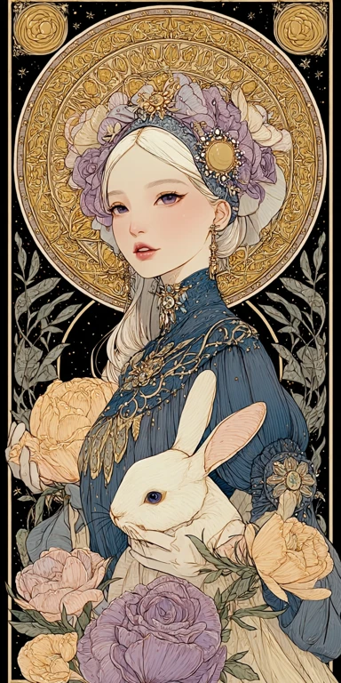

### 风格：自然/风景
1. 提示词：`fatpunk flowery field , fatpunk scenery, flying whales, ghibli style illustration of fat golden sunset --ar 1:2 --v 7.0`
图片：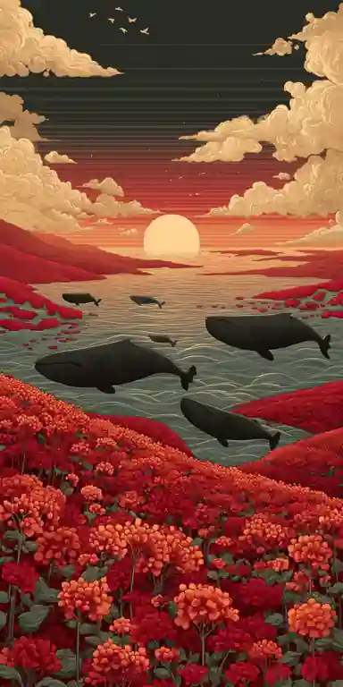
2. 提示词：`VIDEO, A looping 90s anime aesthetic scene, soft pastel colors, VHS film grain, dreamy sunset sky with pink and purple hues, retro Japanese cityscape with neon signs, palm trees swaying gently, nostalgic vibe, vaporwave and lo-fi atmosphere, smooth animation style, cinematic composition, relaxing mood, designed for background video use --ar 1:2 --v 7.0`
图片：
3. 提示词：`summer romance in city-pop style, retro 80's anime style, neon city at sunset, , tropical atmosphere, polaroid memories, romantic city lights in the background, dreamy pastel sky, standing stylish girl with long aquamarine hair and hoop earrings, wearing sportswear and trendy orange sneakers, she is holding a skateboard in her hand, nostalgic mood of summer love, --ar 1:2 --profile eo6xqk1 --v 7.0`
图片：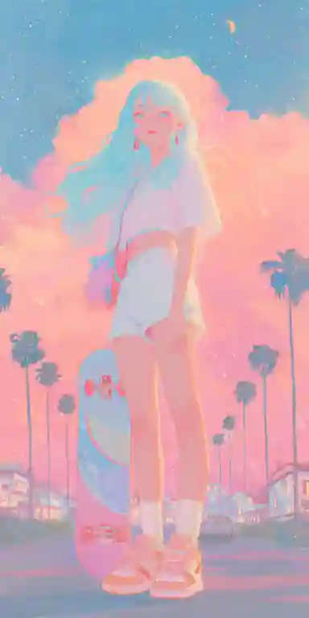
4. 提示词：`A view of Mount Fuji from the city street, in the style of a cartoon, anime-inspired, with a simple background and a blue sky. The city skyline features people walking down the main road, with the large mountain in the distance. It's a bright, sunny day, with vibrant colors and high resolution, high detail, and high quality. --ar 1:2 --v 7.0`
图片：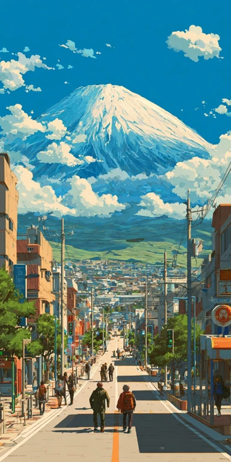
5. 提示词：`a majestic Japanese palace floating gently among golden clouds at sunset, multi-tiered rooftops lined with glowing golden ornaments, silk banners fluttering from tall spires, camera positioned from inside a quiet balcony hallway, warm crimson and orange light flooding through open paper screens, polished wooden floors reflecting faint light, wind gently pushing open paper doors, the horizon stretching infinitely above the clouds, birds circling the palace in slow arcs, soft lens flares, golden atmosphere full of silence and awe, long shadows stretching across architecture, anime Ghibli-style high fantasy realism, layered depth, motion blur on banners, distant glowing lanterns rising slowly --ar 1:2 --quality 2 --raw --stylize 250 --v 7.0`
图片：
6. 提示词：`Serene lofi scene of Kyoto, Japan, featuring a traditional skyline with wooden houses and a pagoda at sunset. A character sits on a balcony, sipping tea, surrounded by drifting cherry blossoms. Soft pastel colors--pinks, purples, and warm yellows. Cozy, dreamy aesthetic --ar 1:2 --v 7.0`
图片：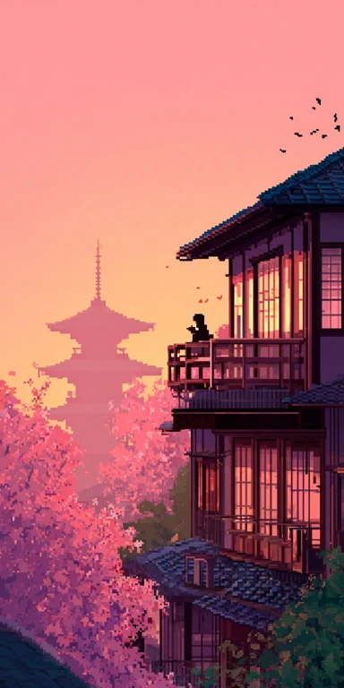

### 风格：赛博霓虹
1. 提示词：`cinematic close-up portrait of a young Asian woman, soft rim light, shallow depth of field, 85mm lens, film grain, natural skin texture, muted teal and amber --chaos 5 --ar 2:3 --stylize 150 --v 7.0`
图片：
2. 提示词：`rainy neon street at night, realistic cyberpunk city, wet asphalt reflections, wide angle 24mm, long exposure, volumetric light, teal and magenta glow --chaos 10 --ar 16:9 --stylize 200 --v 7.0`
图片：
3. 提示词：`VIDEO, A looping 90s anime aesthetic scene, soft pastel colors, VHS film grain, dreamy sunset sky with pink and purple hues, retro Japanese cityscape with neon signs, palm trees swaying gently, nostalgic vibe, vaporwave and lo-fi atmosphere, smooth animation style, cinematic composition, relaxing mood, designed for background video use --ar 1:2 --v 7.0`
图片：
4. 提示词：`minimal Y2K aesthetic pastel gradient background, soft pink lavender blue clouds, gentle glow and subtle sparkles, very few floating elements like one disco ball, one neon heart, light vaporwave vibes, dreamy and clean composition --ar 1:2 --profile f537fk2 --v 7.0`
图片：
5. 提示词：`Pop art by Martine Johanna, Beautiful anime girl, long hair with bangs, pop art by Martine Johanna, She is standing behind the DJ turntables, with panoramic windows overlooking buildings and city lights at dusk, illustrated by a pink neon light. The sky is blue with soft clouds. hyper realistic, wide shot capturing entire scene, sum-nail for YouTube. --ar 1:2 --v 7.0`
图片：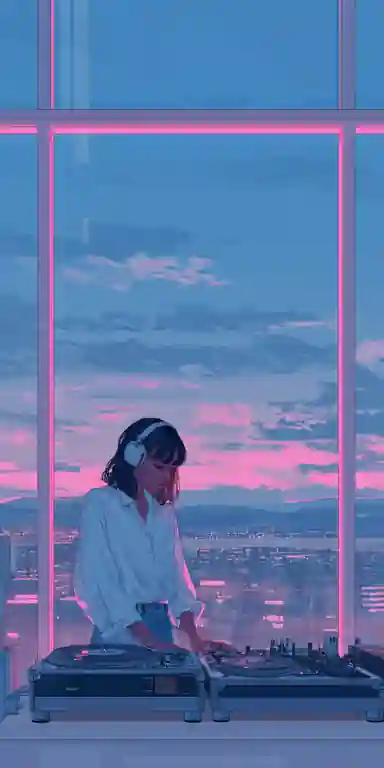
6. 提示词：`summer romance in city-pop style, retro 80's anime style, neon city at sunset, , tropical atmosphere, polaroid memories, romantic city lights in the background, dreamy pastel sky, standing stylish girl with long aquamarine hair and hoop earrings, wearing sportswear and trendy orange sneakers, she is holding a skateboard in her hand, nostalgic mood of summer love, --ar 1:2 --profile eo6xqk1 --v 7.0`
图片：

### 风格：食物
1. 提示词：`retro futuristic minimalist sci-fi illustration of a 3/4 view of a matte black, 1971 Buick Riviera Boattail reimagined as a hovercar, low angle like a music video. The car floats slightly above the ground with no wheels, no wheel wells, and a fully sealed undercarriage. Welded panels and aerodynamic plating replace the wheel arches. Horizontal glowing teal antigravity thrusters emit a soft luminescence beneath the body. The iconic boattail silhouette is preserved but enhanced with smooth, spacecraft-inspired curves. The background is minimal and gradient-based, optimized for a vertical phone wallpaper. Parameters --ar 16:9 --raw --sref https://s.mj.run/DAr6XaTibwQ --profile u9sppho 83u5cvh gv7n6hp lkorbfz --stylize 10 --v 7.0`
图片：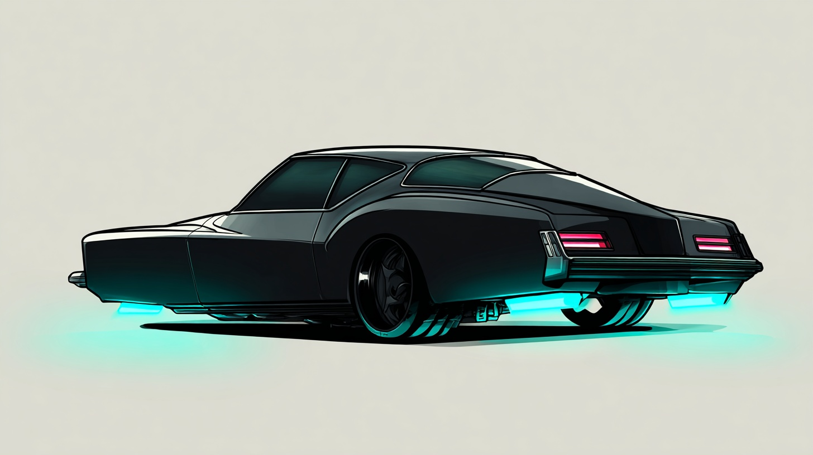
2. 提示词：`https://s.mj.run/VnkXTSO24bc A fluffy white chubby cat wearing a dark blue varsity jacket, red shorts, and neon yellow platform sneakers. It sports oversized reflective sunglasses and modern Bluetooth headphones hanging around its neck. The cat is dancing hip-hop on top of a decorated pushcart, which rolls slowly through a crowded night market lit with colorful neon signs and food stall lights. Reflections, warm glows from cooking smoke, and LED string lights create a stage-like effect, making the cat the center of attention in a lively, festive atmosphere. Whole body --ar 16:9 --profile 9f6vowb --v 7.0`
图片：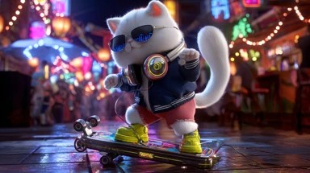
3. 提示词：`A can of cat food and a gray cat perched on the wooden board in the kitchen, meowing and looking up. The close-up shot is composed of the center, creating a blue and white space. The afternoon sunshine is bright, and the 3D cartoon style is cute, C4D，OC 3D cartoon style, C4D，OC， --ar 16:9 --profile ssaafv4 --v 7.0`
图片：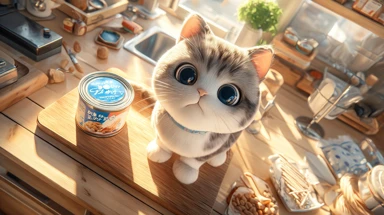
4. 提示词：`https://s.mj.run/NCCJN_eBlKs A Very cute cat-like creature wearing a Chinese Peking Opera headdress, Cartoon character style, Standing like a human, Full body portrait, in the style of Mucha's painting, The overall color is reddish, a Chinese New Year style background, intricate details, flowing lines, soft pastel tones, Art Nouveau aesthetic --no feather --ar 16:9 --profile qbn6ad3 --v 7.0`
图片：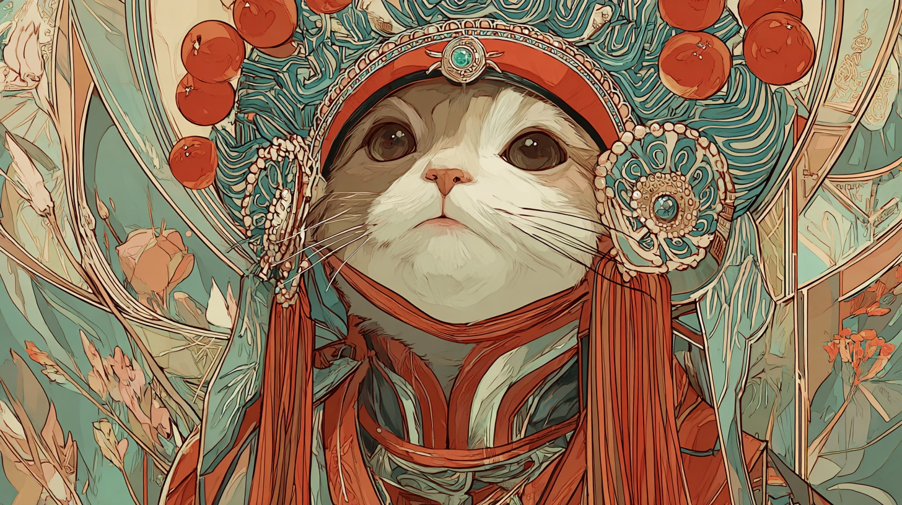
5. 提示词：`https://s.mj.run/IMxbRHyAc7Q chubby anime-style cat with big sparkly eyes and fluffy fur, happily eating slices of cantaloupe cut into perfect pentagon shapes, soft pastel colors, cozy picnic setting, kawaii aesthetic, food anime influence, gentle lighting, heartwarming and cute atmosphere --ar 16:9 --profile jdwixis --stylize 250 --v 7.0`
图片：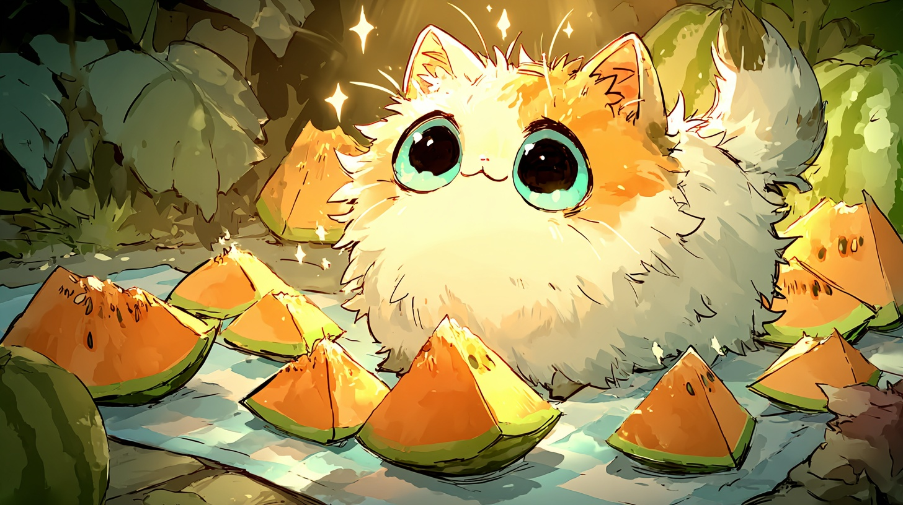
6. 提示词：`A vertical watercolor background divided into three artistic segments with smooth gradient transitions. The left section is painted in soft strawberry-pink and whipped-cream white swirls, evoking the sweetness of dessert. The middle section blends mustard yellow with ketchup red in energetic brush strokes, reflecting a bold, savory street-food vibe. The right section uses warm umami-inspired tones like soy brown and miso beige, layered with subtle ramen bowl shapes and chopstick-like textures. All three sections are done in a cohesive watercolor wash, lightly textured like a handmade food poster vivid, charming, and appetizing, with no objects or text, perfect for a food-themed YouTube Short thumbnail. --ar 16:9 --raw --profile 2z47jjz --v 7.0`
图片：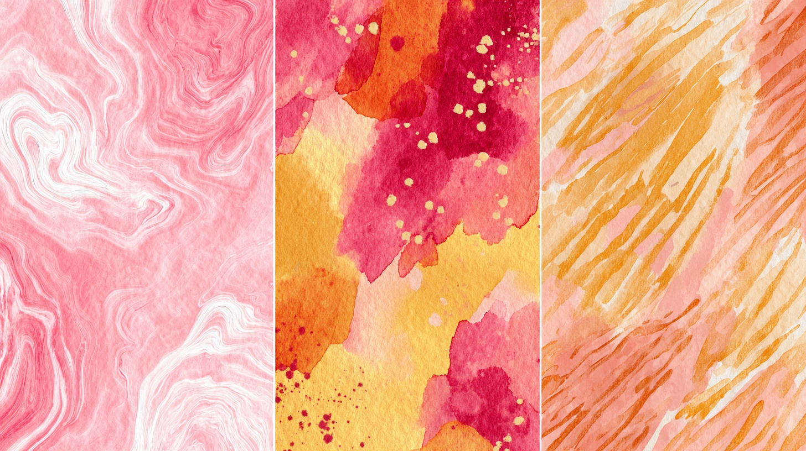
